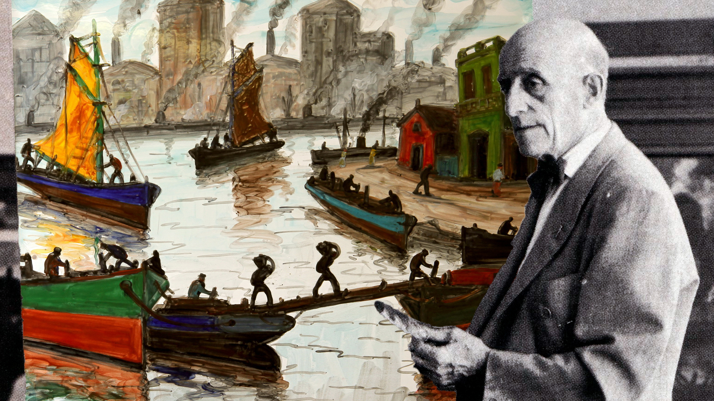

<!DOCTYPE html>
<html lang="en">
<head>
  <meta charset="UTF-8">
  <title>Benito Quinquela Martín</title>
  
</head>
<body>
  <header>
    
    
Benito Quinquela Martín

  </header>
  <nav>
   
    <a href="home.html">Home</a>
    <a href="La Boca.html">La Boca</a>
    <a href="Style.html">Style</a>
    <a href="Famous Art.html">Famous Art</a>
  
</nav>
  <section>
    <h1>About Benito Quinquela Martín</h1>
    
Benito Quinquela Martín (1890-1977) was an Argentine painter known for his depictions of life in the La Boca neighborhood of Buenos Aires, where he grew up. He is often considered one of Argentina's most important artists of the 20th century.

    
Quinquela Martín was born in La Boca in 1890 to immigrant parents from Genoa, Italy. He had a difficult childhood, growing up in poverty and with an absent father. However, he found solace in art, and began drawing and painting at a young age.

    
At the age of 13, Quinquela Martín was taken in by a local businessman, who encouraged his artistic talents and eventually helped him attend the National Academy of Fine Arts in Buenos Aires. He later studied in Europe, where he was influenced by the works of the Impressionists and Post-Impressionists.
          
Quinquela Martín is best known for his depictions of the working-class life in La Boca, particularly its port and shipyards. His paintings often feature bright colors and bold brushstrokes, and are characterized by a sense of movement and energy. He also painted portraits and landscapes, but it is his depictions of La Boca that have become his most iconic works.
      
 Quinquela Martín was not only an artist but also a philanthropist and social activist. He used his wealth and influence to help improve the living conditions of the people in La Boca, building schools, hospitals, and community centers. He also established a foundation to promote the arts and culture in the area.
       
Today, Quinquela Martín is remembered as a beloved figure in Argentine art and culture. His former home in La Boca is now a museum dedicated to his life and work, and his paintings can be found in museums and collections around the world.
        <footer>
          &copy; Teresa Yeh 2023
        </footer>
        
